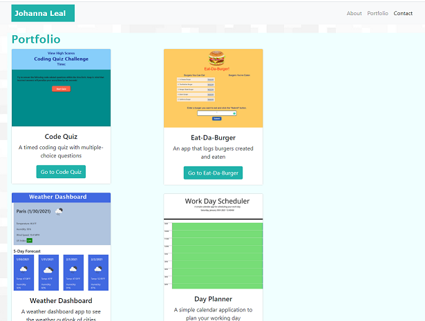
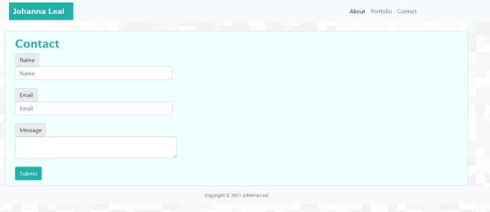

# React Portfolio

## Description

In this homework, I updated my portfolio page to use React. I modified my portfolio to incldue a Navbar, ProjectCard, and Footer component. The ProjectCard component is used to populate the Portfolio page.

## Functionality

* Each page has a basic Bootstrap nav bar, footer, and main component.
* The About page includes an image of me, a blurb about me, and sidebar with links to GitHub, LinkedIn, and a link to download my resume in PDF format.
* The Portfolio page consists of screenshots of six projects that I have completed.
* Each project card contains a screenshot, a brief description, a link to the GitHub repo, and a link to the deployed app.
* The Contact page contains several input fields and a submit button.

## Installation

1. Clone this repo.
2. Install all dependencies from package.json.
3. Create a React app.

## Deployed Website

[Responsive Portfolio Website](https://johannaleal.github.io/updated-portfolio-page/)

## Repository

[Repository](https://github.com/johannaleal/react-portfolio)

## Index.html Page

## Portfolio Page

## Contact Page

